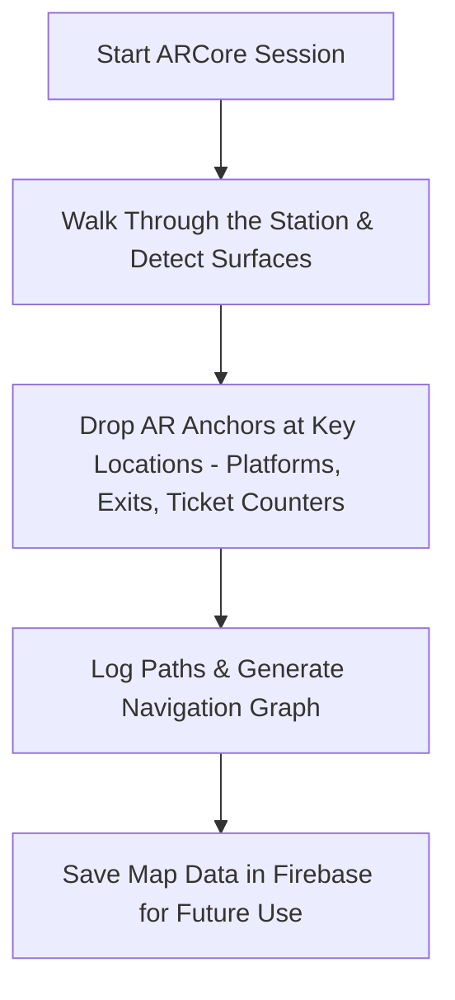
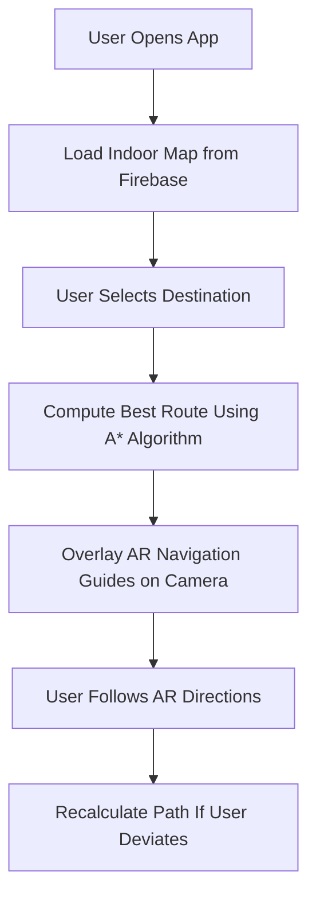

# SIH-1710: Enhancing Navigation for Railway Station Facilities and Locations

## Overview
This project aims to revolutionize indoor navigation at railway stations using **Augmented Reality (AR)** and real-time pathfinding. By leveraging **ARCore**, users can navigate large, unfamiliar station premises with **AR overlays** guiding them to their destination.

## Key Features
✅ **AR-Based Indoor Mapping** – Uses Google ARCore to scan and tag key locations.  
✅ **Real-Time Navigation** – Overlays AR directional arrows for intuitive guidance.  
✅ **Dynamic Indoor Mapping** – Captures railway station layouts dynamically (no preloaded blueprints required).  
✅ **A* Pathfinding Algorithm** – Computes the shortest route efficiently.  
✅ **Firebase Database** – Stores indoor maps, locations, and user data.  
✅ **User-Friendly UI/UX** – Designed using Figma for an intuitive experience.  

## Technology Stack

## Project Workflow

### 1️⃣ Mapping the Railway Station (Admin Mode)

### 2️⃣ User Navigation Mode

