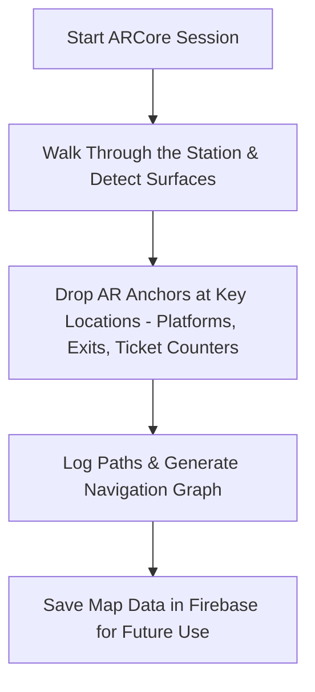
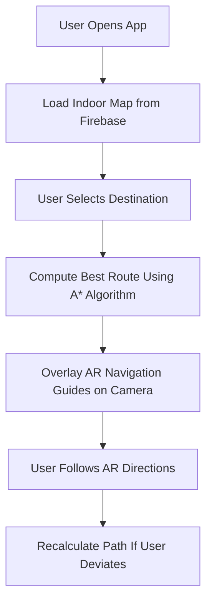

# SIH-1710: Enhancing Navigation for Railway Station Facilities and Locations

## Overview
This project aims to revolutionize indoor navigation at railway stations using **Augmented Reality (AR)** and real-time pathfinding. By leveraging **ARCore**, users can navigate large, unfamiliar station premises with **AR overlays** guiding them to their destination.

## Key Features
✅ **AR-Based Indoor Mapping** – Uses Google ARCore to scan and tag key locations.  
✅ **Real-Time Navigation** – Overlays AR directional arrows for intuitive guidance.  
✅ **Dynamic Indoor Mapping** – Captures railway station layouts dynamically (no preloaded blueprints required).  
✅ **A* Pathfinding Algorithm** – Computes the shortest route efficiently.  
✅ **Firebase Database** – Stores indoor maps, locations, and user data.  
✅ **User-Friendly UI/UX** – Designed using Figma for an intuitive experience.  

## Technology Stack

## Project Workflow

### 1️⃣ Mapping the Railway Station (Admin Mode)

```mermaid
graph TD;
    A["Start ARCore Session"] --> B["Walk Through the Station & Detect Surfaces"];
    B --> C["Drop AR Anchors at Key Locations - Platforms, Exits, Ticket Counters"];
    C --> D["Log Paths & Generate Navigation Graph"];
    D --> E["Save Map Data in Firebase for Future Use"];
```
### 2️⃣ User Navigation Mode

```mermaid
graph TD;
    A[User Opens App] --> B[Load Indoor Map from Firebase];
    B --> C[User Selects Destination];
    C --> D[Compute Best Route Using A* Algorithm];
    D --> E[Overlay AR Navigation Guides on Camera];
    E --> F[User Follows AR Directions];
    F --> G[Recalculate Path If User Deviates];
```

# 🗓️ Weekly Logbook – SIH-1710  
**Project Title:** Enhancing Navigation for Railway Station Facilities and Locations  
**Smart India Hackathon ID:** SIH-1710  

This document captures the weekly progress log for the development of an AR-based indoor navigation system for railway stations.

---
## Stage 1 – Initial Development & Basic Implementation

## ✅ Week 1 – Problem Statement & Objective

**Activities:**
- Defined the core problem of navigation difficulty in large stations.
- Identified primary users: elderly, differently-abled, and tourists.
- Finalized solution goals using ARCore and pathfinding.

**Outcomes:**
- Abstract and objectives drafted.
- Documented problem scope.
- Team brainstorming completed.

---

## ✅ Week 2 – Project Planning & Execution

**Activities:**
- Created a project timeline with key milestones.
- Task distribution:
  - AR Integration – Tejas Jadhav
  - UI/UX Design – Mrunali Badgujar , Tejas Jadhav , Harshal Gaikwad
  - Android Frontend - Mrunali Badgujar
  - Firebase Setup and Work – Mrunali Badgujar
  - Pathfinding Algorithm – Harshal Gaikwad , Nomesh Kirange
  - Documentation / Report - Nomesh Kirange
  - Github Repo maintain and update (Github repo work)- Mrunali Badgujar 
- Set up GitHub repo.

**Outcomes:**
- Development strategy finalized.
- Figma wireframes initiated.

---

## ✅ Week 3 – Technical Content & Implementation

**Activities:**
- Integrated ARCore SDK into Android Studio.
- Began admin mode for scanning and tagging.
- Set up Firebase Firestore structure.
- Planned and analyzed the A* pathfinding algorithm.

**Outcomes:**
- AR anchors placed successfully.
- Firebase backend live with basic structure.

---

## ✅ Week 4 – Results & Testing

**Activities:**
- Tested AR anchors in different indoor setups.
- Verified pathfinding between points A and B.
- Checked AR arrow stability and responsiveness.

**Outcomes:**
- AR navigation successfully demonstrated.
- Improvement areas identified for future iterations.

---

## ✅ Week 5 – Presentation & Documentation

**Activities:**
- Created architecture diagrams (data flow, overlay logic).
- Prepared presentation covering:
  - Problem & Solution
  - Tech Stack
  - User Journey
  - Results
- Recorded demo videos.

**Outcomes:**
- Draft report completed.
- Received and incorporated mentor feedback.

---

## ✅ Week 6 – Team Collaboration

**Activities:**
- Held regular meetings for progress tracking.
- Synced code via GitHub.
- Collaborated on debugging AR and Firebase modules.

**Outcomes:**
- Smooth teamwork and communication.
- Peer-reviewed UI and core logic.

---

## ✅ Week 7 – Scalability & Practical Application

**Activities:**
- Explored broader use cases: airports, shopping malls, hospitals.
- Proposed enhancements:
  - Voice instructions
  - Multi-language support

- Discussed monetization ideas:
  - Government Railway App integration

**Outcomes:**
- Documented future scope in project report.
- Added project roadmap to presentation.

---

## Stage 2 – Completing Implementation & Research

After finishing Stage 1 (frontend and basic ARCore floor detection with map adding), we moved to Stage 2. Here we did a research survey comparing indoor navigation methods, implemented manual ARCore navigation with checkpoints, manual step counting using gyroscope and speedometer for distance/direction, created research paper and PPT, and submitted to conference.

## 🚀 Implementation Progress – I

### **Week 1: Review of Phase-I & GPS Analysis**

**Work Done:**

* Reviewed Phase-I work including UI design, ARCore integration, and floor plane detection.
* Tested GPS performance inside indoor environments such as railway stations.
* Observed high GPS instability, signal loss, and large positional errors.
* Refined ARCore floor detection and anchor stability.

**Outcome:**

* GPS identified as unsuitable for indoor navigation.
* ARCore foundation confirmed stable for further development.

---

### **Week 2: Literature Survey & Sensor-Based Navigation**

**Work Done:**

* Conducted literature survey on indoor navigation technologies.
* Studied Pedestrian Dead Reckoning (PDR) techniques.
* Analyzed accelerometer, gyroscope, and speedometer usage.
* Finalized transition from GPS to sensor-based navigation.

**Outcome:**

* Sensor-based movement tracking selected as core navigation approach.

---

### **Week 3: Firebase Authentication & User Management**

**Work Done:**

* Integrated Firebase Authentication.
* Implemented user registration, login, and password reset.
* Added input validation and error handling.
* Tested authentication flow thoroughly.

**Outcome:**

* Secure user authentication successfully implemented.

---

## 🛠️ Implementation Progress – II

### **Week 4: Manual Indoor Mapping & AR Navigation**

**Work Done:**

* Designed manual indoor routes with predefined checkpoints.
* Implemented ARCore anchors for each checkpoint.
* Developed AR directional arrows for navigation.
* Fixed arrow flickering and alignment issues.

**Outcome:**

* Functional AR-based indoor navigation achieved.

---

### **Week 5: Comparative Study of Indoor Navigation Technologies**

**Work Done:**

* Studied Wi-Fi fingerprinting, BLE beacons, and IMU-based methods.
* Compared accuracy, cost, scalability, and infrastructure needs.
* Prepared comparative analysis tables.

**Outcome:**

* ARCore + IMU approach justified academically and technically.

---

### **Week 6: Step Counting & Direction Estimation**

**Work Done:**

* Implemented step detection using accelerometer.
* Used gyroscope for heading estimation.
* Converted steps to distance using stride length models.
* Integrated sensors with AR checkpoints.
* Tested across multiple phone placements.

**Outcome:**

* Reliable sensor-based positioning implemented.

---

## 🔗 Implementation Progress – III

### **Week 7: Sensor Fusion & Dynamic AR Navigation**

**Work Done:**

* Combined accelerometer, gyroscope, and speedometer data.
* Implemented sensor fusion to reduce noise and drift.
* Updated AR arrows dynamically in real time.
* Tested navigation on long indoor paths.

**Outcome:**

* Accurate and stable sensor fusion-based navigation achieved.

---

### **Week 8: Full App Integration & UI Enhancement**

**Work Done:**

* Integrated authentication, navigation, sensors, and AR modules.
* Enhanced UI with real-time navigation feedback.
* Fixed UI delays and transition issues.
* Performed multi-device testing.
* Recorded demo video.

**Outcome:**

* Fully integrated, stable, and user-friendly application.

---

### **Week 9: Performance Evaluation & Comparison**

**Work Done:**

* Measured step accuracy, positional error, and responsiveness.
* Compared results with Wi-Fi and BLE-based systems.
* Achieved positional error of **2–3 meters**.
* Documented observations and results.

**Outcome:**

* System effectiveness validated experimentally.

---

## 🧪 Testing, Results & Discussion

### **Week 10: Functional Testing & Optimization**

**Work Done:**

* Conducted module-wise and system-level testing.
* Fixed UI, sensor synchronization, and AR rendering bugs.
* Fine-tuned system parameters.

**Outcome:**

* Stable and optimized system.

---

### **Week 11: Result Analysis & Discussion**

**Work Done:**

* Analyzed accuracy, response time, and sensor drift.
* Compared results with existing indoor navigation techniques.
* Prepared result graphs and performance tables.

**Outcome:**

* Strong performance validation achieved.

---

### **Week 12: Final Testing Review**

**Work Done:**

* Verified all test results.
* Finalized testing documentation.
* Prepared evaluation summary.

**Outcome:**

* System ready for final submission.

---

## 📄 Report Writing, Conclusion & Submission

### **Week 13: Documentation & Academic Submission**

**Work Done:**

* Prepared full project report as per university format.
* Documented literature survey, methodology, implementation, and results.
* Added future scope including multi-floor navigation and auto-mapping.
* Prepared professional PowerPoint presentation.
* Submitted research paper to a student research conference.

**Outcome:**

* Project Stage-II successfully completed with complete documentation and academic submission.

## 🧑‍💻 Team Note

We maintained consistent coordination, shared responsibilities, and collaborated effectively throughout the project timeline to ensure on-time delivery and quality outcomes.

---

