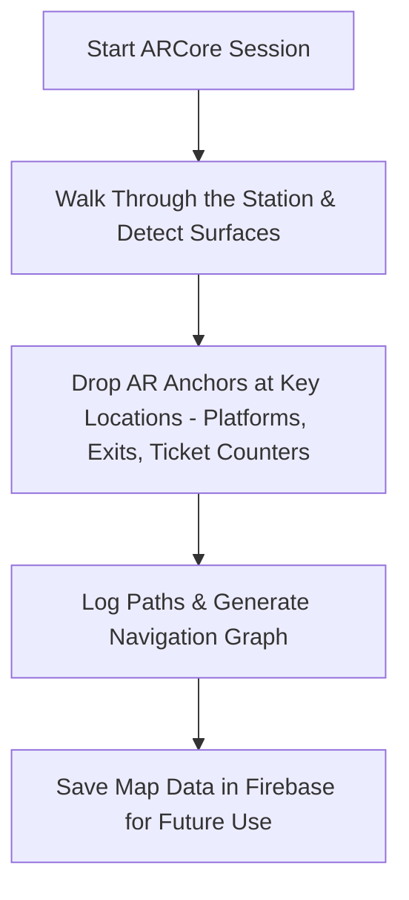
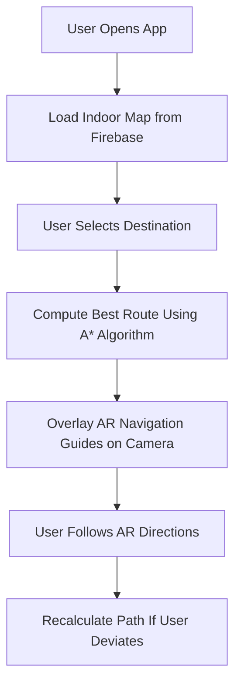

# SIH-1710: Enhancing Navigation for Railway Station Facilities and Locations

## Overview
This project aims to revolutionize indoor navigation at railway stations using **Augmented Reality (AR)** and real-time pathfinding. By leveraging **ARCore**, users can navigate large, unfamiliar station premises with **AR overlays** guiding them to their destination.

## Key Features
✅ **AR-Based Indoor Mapping** – Uses Google ARCore to scan and tag key locations.  
✅ **Real-Time Navigation** – Overlays AR directional arrows for intuitive guidance.  
✅ **Dynamic Indoor Mapping** – Captures railway station layouts dynamically (no preloaded blueprints required).  
✅ **A* Pathfinding Algorithm** – Computes the shortest route efficiently.  
✅ **Firebase Database** – Stores indoor maps, locations, and user data.  
✅ **User-Friendly UI/UX** – Designed using Figma for an intuitive experience.  

## Technology Stack

## Project Workflow

### 1️⃣ Mapping the Railway Station (Admin Mode)

```mermaid
graph TD;
    A["Start ARCore Session"] --> B["Walk Through the Station & Detect Surfaces"];
    B --> C["Drop AR Anchors at Key Locations - Platforms, Exits, Ticket Counters"];
    C --> D["Log Paths & Generate Navigation Graph"];
    D --> E["Save Map Data in Firebase for Future Use"];
```
### 2️⃣ User Navigation Mode

```mermaid
graph TD;
    A[User Opens App] --> B[Load Indoor Map from Firebase];
    B --> C[User Selects Destination];
    C --> D[Compute Best Route Using A* Algorithm];
    D --> E[Overlay AR Navigation Guides on Camera];
    E --> F[User Follows AR Directions];
    F --> G[Recalculate Path If User Deviates];
```

# 🗓️ Weekly Logbook – SIH-1710  
**Project Title:** Enhancing Navigation for Railway Station Facilities and Locations  
**Smart India Hackathon ID:** SIH-1710  

This document captures the weekly progress log for the development of an AR-based indoor navigation system for railway stations.

---

## ✅ Week 1 – Problem Statement & Objective

**Activities:**
- Defined the core problem of navigation difficulty in large stations.
- Identified primary users: elderly, differently-abled, and tourists.
- Finalized solution goals using ARCore and pathfinding.

**Outcomes:**
- Abstract and objectives drafted.
- Documented problem scope.
- Team brainstorming completed.

---

## ✅ Week 2 – Project Planning & Execution

**Activities:**
- Created a project timeline with key milestones.
- Task distribution:
  - AR Integration – Tejas Jadhav
  - UI/UX Design – Mrunali Badgujar , Tejas Jadhav , Harshal Gaikwad
  - Android Frontend - Tejas Jadhav , Mrunali Badgujar
  - Firebase Setup and Work – Mrunali Badgujar
  - Pathfinding Algorithm – Harshal Gaikwad , Nomesh Kirange
  - Documentation / Report - Nomesh Kirange
  - Github Repo maintain and update (Github repo work)- Mrunali Badgujar 
- Set up GitHub repo.

**Outcomes:**
- Development strategy finalized.
- Figma wireframes initiated.

---

## ✅ Week 3 – Technical Content & Implementation

**Activities:**
- Integrated ARCore SDK into Android Studio.
- Began admin mode for scanning and tagging.
- Set up Firebase Firestore structure.
- Planned and analyzed the A* pathfinding algorithm.

**Outcomes:**
- AR anchors placed successfully.
- Firebase backend live with basic structure.

---

## ✅ Week 4 – Results & Testing

**Activities:**
- Tested AR anchors in different indoor setups.
- Verified pathfinding between points A and B.
- Checked AR arrow stability and responsiveness.

**Outcomes:**
- AR navigation successfully demonstrated.
- Improvement areas identified for future iterations.

---

## ✅ Week 5 – Presentation & Documentation

**Activities:**
- Created architecture diagrams (data flow, overlay logic).
- Prepared presentation covering:
  - Problem & Solution
  - Tech Stack
  - User Journey
  - Results
- Recorded demo videos.

**Outcomes:**
- Draft report completed.
- Received and incorporated mentor feedback.

---

## ✅ Week 6 – Team Collaboration

**Activities:**
- Held regular meetings for progress tracking.
- Synced code via GitHub.
- Collaborated on debugging AR and Firebase modules.

**Outcomes:**
- Smooth teamwork and communication.
- Peer-reviewed UI and core logic.

---

## ✅ Week 7 – Scalability & Practical Application

**Activities:**
- Explored broader use cases: airports, shopping malls, hospitals.
- Proposed enhancements:
  - Voice instructions
  - Multi-language support

- Discussed monetization ideas:
  - Government Railway App integration

**Outcomes:**
- Documented future scope in project report.
- Added project roadmap to presentation.

---

## 🧑‍💻 Team Note

We maintained consistent coordination, shared responsibilities, and collaborated effectively throughout the project timeline to ensure on-time delivery and quality outcomes.

---

