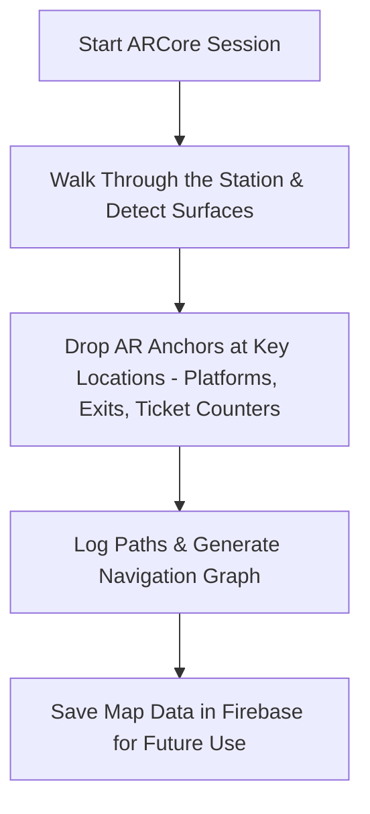
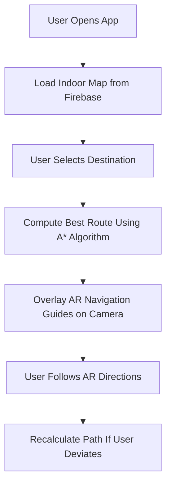

# SIH-1710: Enhancing Navigation for Railway Station Facilities and Locations

## Overview
This project aims to revolutionize indoor navigation at railway stations using **Augmented Reality (AR)** and real-time pathfinding. By leveraging **ARCore**, users can navigate large, unfamiliar station premises with **AR overlays** guiding them to their destination.

## Key Features
✅ **AR-Based Indoor Mapping** – Uses Google ARCore to scan and tag key locations.  
✅ **Real-Time Navigation** – Overlays AR directional arrows for intuitive guidance.  
✅ **Dynamic Indoor Mapping** – Captures railway station layouts dynamically (no preloaded blueprints required).  
✅ **A* Pathfinding Algorithm** – Computes the shortest route efficiently.  
✅ **Firebase Database** – Stores indoor maps, locations, and user data.  
✅ **User-Friendly UI/UX** – Designed using Figma for an intuitive experience.  

## Technology Stack

## Project Workflow

### 1️⃣ Mapping the Railway Station (Admin Mode)

```mermaid
graph TD;
    A["Start ARCore Session"] --> B["Walk Through the Station & Detect Surfaces"];
    B --> C["Drop AR Anchors at Key Locations - Platforms, Exits, Ticket Counters"];
    C --> D["Log Paths & Generate Navigation Graph"];
    D --> E["Save Map Data in Firebase for Future Use"];
```
### 2️⃣ User Navigation Mode

```mermaid
graph TD;
    A[User Opens App] --> B[Load Indoor Map from Firebase];
    B --> C[User Selects Destination];
    C --> D[Compute Best Route Using A* Algorithm];
    D --> E[Overlay AR Navigation Guides on Camera];
    E --> F[User Follows AR Directions];
    F --> G[Recalculate Path If User Deviates];
```

# 🗓️ Weekly Logbook – SIH-1710  
**Project Title:** Enhancing Navigation for Railway Station Facilities and Locations  
**Smart India Hackathon ID:** SIH-1710  

This document captures the weekly progress log for the development of an AR-based indoor navigation system for railway stations.

---
## Stage 1 – Initial Development & Basic Implementation

## ✅ Week 1 – Problem Statement & Objective

**Activities:**
- Defined the core problem of navigation difficulty in large stations.
- Identified primary users: elderly, differently-abled, and tourists.
- Finalized solution goals using ARCore and pathfinding.

**Outcomes:**
- Abstract and objectives drafted.
- Documented problem scope.
- Team brainstorming completed.

---

## ✅ Week 2 – Project Planning & Execution

**Activities:**
- Created a project timeline with key milestones.
- Task distribution:
  - AR Integration – Tejas Jadhav
  - UI/UX Design – Mrunali Badgujar , Tejas Jadhav , Harshal Gaikwad
  - Android Frontend - Mrunali Badgujar
  - Firebase Setup and Work – Mrunali Badgujar
  - Pathfinding Algorithm – Harshal Gaikwad , Nomesh Kirange
  - Documentation / Report - Nomesh Kirange
  - Github Repo maintain and update (Github repo work)- Mrunali Badgujar 
- Set up GitHub repo.

**Outcomes:**
- Development strategy finalized.
- Figma wireframes initiated.

---

## ✅ Week 3 – Technical Content & Implementation

**Activities:**
- Integrated ARCore SDK into Android Studio.
- Began admin mode for scanning and tagging.
- Set up Firebase Firestore structure.
- Planned and analyzed the A* pathfinding algorithm.

**Outcomes:**
- AR anchors placed successfully.
- Firebase backend live with basic structure.

---

## ✅ Week 4 – Results & Testing

**Activities:**
- Tested AR anchors in different indoor setups.
- Verified pathfinding between points A and B.
- Checked AR arrow stability and responsiveness.

**Outcomes:**
- AR navigation successfully demonstrated.
- Improvement areas identified for future iterations.

---

## ✅ Week 5 – Presentation & Documentation

**Activities:**
- Created architecture diagrams (data flow, overlay logic).
- Prepared presentation covering:
  - Problem & Solution
  - Tech Stack
  - User Journey
  - Results
- Recorded demo videos.

**Outcomes:**
- Draft report completed.
- Received and incorporated mentor feedback.

---

## ✅ Week 6 – Team Collaboration

**Activities:**
- Held regular meetings for progress tracking.
- Synced code via GitHub.
- Collaborated on debugging AR and Firebase modules.

**Outcomes:**
- Smooth teamwork and communication.
- Peer-reviewed UI and core logic.

---

## ✅ Week 7 – Scalability & Practical Application

**Activities:**
- Explored broader use cases: airports, shopping malls, hospitals.
- Proposed enhancements:
  - Voice instructions
  - Multi-language support

- Discussed monetization ideas:
  - Government Railway App integration

**Outcomes:**
- Documented future scope in project report.
- Added project roadmap to presentation.

---

## Stage 2 – Completing Implementation & Research

After finishing Stage 1 (frontend and basic ARCore floor detection with map adding), we moved to Stage 2. Here we did a research survey comparing indoor navigation methods, implemented manual ARCore navigation with checkpoints, manual step counting using gyroscope and speedometer for distance/direction, created research paper and PPT, and submitted to conference.

### Week 1 – Firebase Auth Setup

In Week 1 of Stage 2, we completed Firebase authentication fully. We enabled email/password sign-in in the Firebase console and added signup, login, and forgot password logic implementation in our Android app. Users now get an email link to reset passwords if they forget, making the app secure and user-friendly.

We tested auth flows end-to-end: new users register with email and password, store user data in Firebase, and login smoothly. We handled errors like weak passwords or invalid emails. By week's end, all users must log in to access station selection and AR navigation.

### Week 2 – Manual ARCore Arrows with Checkpoints

Week 2 focused on manual ARCore navigation implementation. We created a manual map, added checkpoints from source to destination, and rendered stable AR arrows based on straight paths and number of turns between checkpoints.

We fixed arrow flickering using ARCore pose tracking and smoothing. Arrows show direction at specific distances with manual turn counts. We tested in indoor spaces simulating station halls.

Developer mode was polished – we scanned, placed, and saved multiple anchors with POI (Point of Interest) details manually. By end of week, end-to-end worked: select points → manual checkpoints → follow AR arrows.

### Week 3 – Research Survey on Indoor Navigation Methods

In Week 3, we conducted literature survey comparing indoor positioning: WiFi (4-8m accuracy but needs infrastructure), BLE (3-5m but beacon deployment), vs IMU sensors (accelerometer/gyroscope step counting 93-97% accuracy, no extra hardware).

We studied 20+ papers on ARCore navigation, manual step detection via peak analysis on accelerometer magnitude, and gyroscope for heading/turns. IMU methods showed best for real time without setup costs.

This survey justified our choice: ARCore + manual IMU step counting over radio-based methods. We documented comparisons with accuracy tables for paper.

### Week 4 – Manual Step Counting Implementation

Week 4 implemented manual step counting using phone sensors. We used accelerometer for step detection (peak detection on magnitude data) and gyroscope for direction/turns, estimating distance with stride length.

Speedometer data helped refine distance per step. Manual checkpoints reset drift – count steps from source to next checkpoint, show AR arrows for straight/turn paths.

Tests showed 95%+ step accuracy across phone positions. Integrated with ARCore: steps update position along manual map path.

### Week 5 – Full Sensor Integration & Testing

Week 5 fused gyroscope (turns/heading) + speedometer (distance) with ARCore. Manual path: source → checkpoints → destination with predefined step counts and turn directions.

AR arrows trigger at checkpoint distances: "straight 50 steps" or "turn left after 20 steps". Tested full flow in 100m indoor path – minimal drift with manual resets.

Validated against survey: our IMU+ARCore (2-3m error) beat WiFi/BLE infrastructure needs. Ready for research documentation.

### Week 6 – App Integration & Demo Preparation

Week 6 joined everything: login → station select → manual map with checkpoints → start AR navigation showing step count, distance remaining, turn alerts via arrows.

Fixed checkpoint arrow snapping and added "recalibrate at checkpoint" using ARCore anchors. Recorded full demo video: user follows manual steps/turns to destination.

App stable across devices. Prepared data/logs for paper: step accuracy graphs, path error vs survey methods.

### Week 7 – Research Paper, PPT & Conference Submission

Week 7 wrote research paper "ARCore+IMU Step Counting for Railway Station Navigation". Included survey (WiFi/BLE/IMU comparisons), our manual method (checkpoints, sensor fusion), results (95% step accuracy, real-time turns), future scope.

Created PPT with architecture, demos, comparison tables. Submitted to student conference, now waiting for acceptance response and presentation slot.

**Stage 2 complete** – working app, validated research, ready for conference.

## 🧑‍💻 Team Note

We maintained consistent coordination, shared responsibilities, and collaborated effectively throughout the project timeline to ensure on-time delivery and quality outcomes.

---

